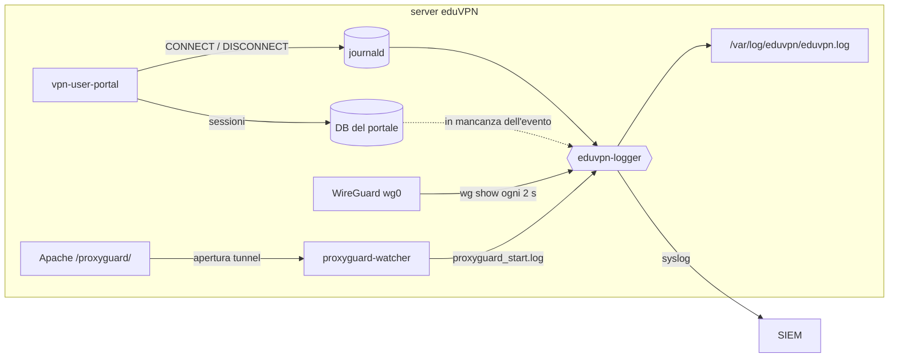
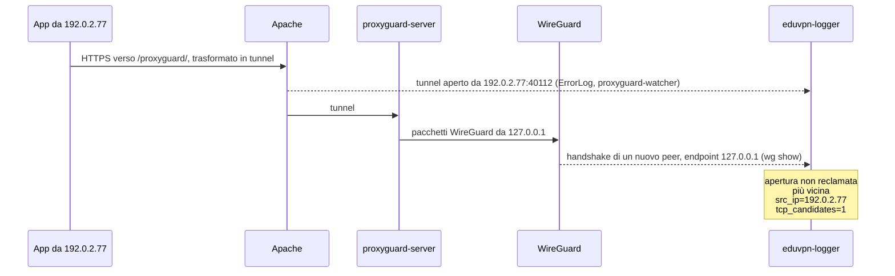

# eduvpn-logger

*🇬🇧 [Read in English](README.md)*

[](LICENSE)
[](#requisiti)
[](https://www.eduvpn.org/)
[](#requisiti)

**Chi si è connesso al tuo server [eduVPN](https://www.eduvpn.org/), da dove e
quando: una riga di log per ogni evento di sessione WireGuard, in tempo reale,
pronta per il tuo SIEM.**

eduVPN registra l'indirizzo da cui si connette un client VPN solo per OpenVPN:
la [documentazione di eduVPN](https://docs.eduvpn.org/server/v3/logging.html)
lo dice esplicitamente (*"currently only available when clients connect using
OpenVPN"*). Con WireGuard nessun log risponde alle domande che prima o poi un
team di risposta agli incidenti deve affrontare: *quale account c'era dietro
203.0.113.45 ieri notte? Da dove si è connessa alice? Quando è iniziata e
finita quella sessione?* Il portale conosce l'utente ma non l'indirizzo.
WireGuard conosce l'indirizzo ma non l'utente, non ha il concetto di
connessione e non registra nulla. Dietro ProxyGuard, il ripiego di eduVPN che
trasporta WireGuard su HTTPS, perfino il kernel vede ogni client come
`127.0.0.1`.

**eduvpn-logger colma questa lacuna.** Segue in tempo reale il portale,
WireGuard e Apache, li unisce sulla public key WireGuard e scrive una riga
`chiave=valore` per ogni evento di sessione (`connect`, `roam`, `disconnect`)
su file e su syslog:

```
2026-04-15T09:58:03.412871+02:00 event=connect user=alice profile=staff device=ios conn=soAQTNO...= tunnel_ip4="10.20.0.5" tunnel_ip6="fd00:20::5" src_ip="203.0.113.45" src_port=48049 transport=udp country="Italy" city="Trieste"
2026-04-15T10:41:22.090113+02:00 event=roam user=alice profile=staff device=ios conn=soAQTNO...= tunnel_ip4="10.20.0.5" tunnel_ip6="fd00:20::5" src_ip_old="203.0.113.45" src_port_old=48049 src_ip="198.51.100.12" src_port=51234 transport=udp country="Italy" city="Trieste"
2026-04-15T11:02:57.731204+02:00 event=disconnect user=alice profile=staff device=ios conn=soAQTNO...= bytes_in=227252 bytes_out=49292 src_ip="198.51.100.12" src_port=51234 transport=udp country="Italy" city="Trieste"
2026-04-15T12:10:04.861203+02:00 event=connect user=bob profile=students device=windows conn=GUUepz8z...= tunnel_ip4="10.20.1.9" tunnel_ip6="fd00:21::9" src_ip="192.0.2.77" src_port=40112 transport=tcp tcp_candidates=1 country="Austria" city="Vienna"
2026-04-15T13:27:41.528310+02:00 event=disconnect user=bob profile=students device=windows conn=GUUepz8z...= bytes_in=18733211 bytes_out=402115980 src_ip="192.0.2.77" src_port=40112 transport=tcp inferred=1 country="Austria" city="Vienna"
```

*alice si connette da casa, passa alla rete mobile e si disconnette; bob
raggiunge il server tramite ProxyGuard, poi il portatile di bob va in
sospensione (public key abbreviate).*

- **Completo**: utente, profilo, dispositivo, indirizzi del tunnel, IP e porta
  pubblici di provenienza (IPv4 e IPv6), trasporto, traffico, paese e città.
- **Vede oltre ProxyGuard**: ricava l'indirizzo reale dei client che
  trasportano WireGuard su HTTPS, e dice quanto è certo ogni abbinamento.
- **Autosufficiente**: un daemon Python in un solo file, solo standard
  library, più un piccolo servizio di supporto per ProxyGuard. Niente da
  compilare, nessuna patch a eduVPN, nessun modulo del kernel.
- **Pronto con un comando** su ogni sistema supportato da eduVPN 3: attiva in
  eduVPN quello che gli serve, verifica ogni modifica e controlla il risultato.
- **In produzione** all'Università di Trieste.

## Indice

- [Il problema](#il-problema)
- [Cosa lo rende diverso](#cosa-lo-rende-diverso)
- [Come funziona](#come-funziona)
- [Requisiti](#requisiti)
- [Installazione](#installazione)
- [Configurazione](#configurazione)
- [Formato del log](#formato-del-log)
- [Usare il log](#usare-il-log)
- [Limiti](#limiti)
- [Sicurezza e privacy](#sicurezza-e-privacy)
- [Aggiornamento e rimozione](#aggiornamento-e-rimozione)
- [Domande frequenti](#domande-frequenti)
- [Progetti collegati](#progetti-collegati)
- [Licenza](#licenza)

## Il problema

Su un server eduVPN ogni informazione su una sessione WireGuard sta in un posto
diverso, e nessuna basta da sola:

| Sorgente | Sa | Non sa |
|---|---|---|
| Portale (`vpn-user-portal`) | utente, profilo, public key, indirizzi del tunnel e traffico di ogni sessione | da dove si connette il client: lo registra solo per OpenVPN |
| WireGuard | public key, endpoint attuale, ultimo handshake e traffico di ogni peer | utenti, connessioni, storia: non registra nulla, e un nuovo endpoint sostituisce in silenzio il precedente |
| Apache, con ProxyGuard | l'indirizzo reale di ogni tunnel TCP | quale peer WireGuard viaggia nel tunnel; il suo access log scrive una richiesta solo quando finisce, giorni dopo per un tunnel lungo |

La public key WireGuard è l'unico identificatore che portale e WireGuard hanno
in comune, e nulla collega un tunnel di Apache a un peer WireGuard. I logger
WireGuard generici, come [wglogger](https://codeberg.org/flaruina/wglogger),
registrano public key ed endpoint ma lasciano a te l'unione con il portale, e
non vedono oltre ProxyGuard, il cui traffico arriva a WireGuard da
`127.0.0.1`. eduvpn-logger ricostruisce i collegamenti mancanti, in tempo
reale.

## Cosa lo rende diverso

- **Sessioni su un protocollo senza connessioni.** WireGuard conserva solo
  l'endpoint attuale e l'ora dell'ultimo handshake di ogni peer. eduvpn-logger
  li legge ogni 2 secondi e ne ricava gli eventi di connect, roam e
  disconnect: nessun modulo del kernel, niente conntrack né eBPF, nessuna patch
  a eduVPN.
- **L'indirizzo reale dietro ProxyGuard.** Apache conosce il client di un
  tunnel TCP, WireGuard conosce il peer, e nulla lega i due. eduvpn-logger fa
  registrare ad Apache l'apertura di ogni tunnel e la abbina nel tempo
  all'handshake WireGuard. Ogni tunnel viene attribuito una sola volta, e il
  campo `tcp_candidates` dice quanti tunnel erano possibili, così un
  abbinamento ambiguo si riconosce come tale.
- **L'identità dalla fonte autorevole.** Utente e profilo arrivano dagli
  eventi CONNECT del portale stesso; il database del portale, aperto in sola
  lettura e con lo schema riconosciuto a runtime, supplisce quando un evento
  manca.
- **Nessun evento del portale perso.** La posizione nel journal viene salvata
  dopo ogni evento del portale: gli eventi registrati mentre il daemon era
  fermo vengono elaborati al suo avvio, con il loro timestamp originale.
- **Costruito sul comportamento reale di eduVPN.** I peer ricreati da
  `vpn-maint-apply-changes` (contatori azzerati, nessun handshake) non chiudono
  le loro sessioni né perdono il traffico totalizzato. Una public key riusata
  tramite l'API apre una sessione nuova. Un NAT che cambia solo la porta non è
  un roam. Una connessione mobile instabile produce al massimo una riga roam
  ogni 30 s, e l'ultimo spostamento non va mai perso. Una sessione chiusa dal
  portale mentre `wg show` è in corso non viene riaperta.
- **Adatto ai SIEM.** Una riga per evento, chiavi in ordine fisso, l'ora
  dell'evento riportata nella copia syslog, e i valori forniti dagli utenti
  sanificati, così non possono falsificare chiavi.
- **Sicuro per impostazione predefinita.** Gli eventi del portale sono
  accettati solo da account di sistema, in base all'UID del mittente che
  journald registra e che il mittente non può falsificare. Il servizio gira in
  una sandbox systemd con quattro capability e senza accesso alla rete. I log
  sono privati (`0640 root:adm`) e conservati 180 giorni.
- **Pronto all'uso.** `install.sh` lo installa con un comando, attiva il log
  delle connessioni del portale e il trace ProxyGuard di Apache se sono spenti
  (ogni modifica verificata prima di essere applicata, con backup) e controlla
  il risultato. Provato su Debian, Ubuntu, AlmaLinux e Fedora, e su server
  eduVPN 3 reali.

## Come funziona



Il daemon legge queste sorgenti e le unisce sulla **public key WireGuard**:

| Sorgente | Cosa fornisce | Come viene letta |
|---|---|---|
| eventi del portale | utente, profilo, public key, IP del tunnel, traffico | journald, `SYSLOG_IDENTIFIER=vpn-user-portal`, dalla posizione salvata |
| database del portale | utente, profilo, IP del tunnel e app di una public key | `/var/lib/vpn-user-portal/db.sqlite`, tabella `wg_peers`, sola lettura, quando manca un evento |
| WireGuard | endpoint (`IP:porta` pubblici), ultimo handshake, traffico di ogni peer | `wg show all dump`, ogni 2 s |
| ProxyGuard *(opzionale)* | `IP:porta` reali del client di ogni tunnel TCP, alla sua apertura | `ErrorLog` di Apache → `proxyguard-watcher` → `proxyguard_start.log` |

### Dallo stato di WireGuard alle sessioni

WireGuard non ha il concetto di connessione, quindi gli eventi sono ricavati
dallo stato dei peer letto a ogni interrogazione:

- **connect**: un peer inizia a fare handshake. Se il portale ha annunciato la
  sessione, la riga viene scritta subito, con l'ora dell'evento del portale e
  la provenienza dell'handshake. Altrimenti attende fino a 10 s che l'evento
  del portale o il suo database indichino l'utente, e porta l'ora del primo
  handshake. Una sessione annunciata dal portale che non fa handshake entro 2
  minuti viene scritta senza provenienza, che arriva poi in una riga roam
  all'arrivo dell'handshake.
- **roam**: cambia la provenienza di un peer attivo, compreso il passaggio tra
  UDP e ProxyGuard. Un cambio della sola porta (rebinding NAT) è ignorato. Al
  massimo una riga roam per peer ogni 30 s: uno spostamento dentro
  quell'intervallo viene scritto alla sua fine, con l'ora in cui è avvenuto, a
  meno che il peer non sia tornato dov'era.
- **disconnect**: quando l'app eduVPN si disconnette si usa il DISCONNECT del
  portale, con i suoi contatori di traffico. Altrimenti (client WireGuard
  generico, portatile in sospensione, rete persa) la sessione termina dopo
  180 s senza handshake, la durata delle chiavi di WireGuard, con i contatori
  di WireGuard.

Utente, profilo e indirizzi del tunnel vengono dall'evento CONNECT del
portale, oppure dal database del portale tramite la public key; `-` se nessuno
dei due la conosce. `device` deriva dall'ID client OAuth delle app eduVPN,
Let's Connect! e govVPN, così come lo registra il portale. Le righe connect e
disconnect non supportate da un evento del portale hanno **`inferred=1`** (le
righe roam vengono sempre da WireGuard).

### ProxyGuard: ricavare l'indirizzo reale del client

Sulle reti che bloccano UDP le app eduVPN raggiungono WireGuard tramite
[ProxyGuard](https://docs.eduvpn.org/server/v3/wireguard.html): una
connessione HTTPS ad Apache, trasformata in tunnel e passata a
`proxyguard-server`, che consegna i pacchetti WireGuard alla porta UDP locale.
WireGuard vede quindi ognuno di questi client come `127.0.0.1`.



Con il trace che `install.sh` attiva, Apache scrive una riga all'apertura di
un tunnel (`AH10212 ... tunnel running`, con `[client IP:porta]`) e
`proxyguard-watcher` la trasforma in un evento di apertura. Una nuova sessione
WireGuard, o un nuovo tunnel di una sessione attiva, viene abbinata
all'apertura non ancora reclamata più vicina, da circa 30 s prima a 3 s dopo
il momento in cui WireGuard la vede; l'apertura viene poi reclamata, così non
può essere data a un altro client. Se l'apertura non è ancora arrivata, la
connect la attende fino a 20 s. `tcp_candidates` indica quante aperture
c'erano nella finestra: `1` significa che non c'erano altri candidati.

### Tempi

| Cosa | Default | Impostazione |
|---|---|---|
| intervallo di lettura di WireGuard | 2 s | `EDUVPN_WG_POLL_SEC` |
| attesa dell'utente di un nuovo peer | 10 s | `EDUVPN_CONNECT_GRACE_SEC` |
| attesa dell'apertura ProxyGuard di una sessione TCP | 20 s | — |
| attesa del primo handshake di una sessione annunciata dal portale | 120 s | — |
| finestra di abbinamento ProxyGuard | 30 s + una lettura prima, 3 s dopo che WireGuard vede il tunnel | — |
| intervallo minimo tra righe roam dello stesso peer | 30 s | `EDUVPN_ROAM_MIN_INTERVAL_SEC` |
| silenzio dell'handshake prima di un disconnect dedotto | 180 s (minimo) | `EDUVPN_DISCONNECT_AFTER_SEC` |

### Stato

La posizione nel journal è conservata in `/var/lib/eduvpn-logger`. Tutto il
resto è in memoria e limitato alle sessioni attive: a ogni lettura viene
riallineato con `wg show`. Dopo un riavvio le sessioni ancora attive vengono
annunciate di nuovo (vedi [Limiti](#limiti)); una posizione nel journal
corrotta o scaduta viene riconosciuta, segnalata, e la lettura riparte dal
momento attuale.

## Requisiti

- Server eduVPN v3 (`vpn-user-portal`) con WireGuard, su qualunque sistema
  supportato da eduVPN 3: Debian, Ubuntu, Enterprise Linux (RHEL, AlmaLinux,
  Rocky) e Fedora. Provato su Debian 13, Ubuntu 22.04, 24.04 e 26.04,
  AlmaLinux 9 e 10, Fedora 43 e 44.
- Portale e WireGuard sulla stessa macchina: il daemon legge journal e database
  del portale ed esegue `wg show` in locale. Le installazioni multi-nodo, con il
  portale su un controller separato, non sono supportate.
- systemd; `wireguard-tools` (`wg`) e Python ≥ 3.9, solo standard library
  (entrambi installati da `install.sh` se mancano).
- I template di connect/disconnect (consigliati) richiedono vpn-user-portal ≥
  3.5.0; anche il formato di log predefinito del portale è riconosciuto.
- *Opzionale:* `python3-maxminddb` e un database MaxMind GeoLite2-City per
  `country` e `city` ([GeoIP](#geoip-opzionale)).

## Installazione

Sul server eduVPN:

```bash
git clone https://github.com/giacomocamata/eduvpn-logger.git
cd eduvpn-logger
sudo ./install.sh
```

Su un server eduVPN standard non serve altro: `install.sh` installa il logger,
attiva lato eduVPN quello che gli serve se è spento, avvia tutto e lo verifica.
È idempotente: rieseguilo per aggiornare, o dopo aver cambiato la configurazione
di eduVPN.

| Parte | Cosa fa `install.sh` |
|---|---|
| log delle connessioni del portale | se è spento lo attiva in `/etc/vpn-user-portal/config.php` con i template consigliati. La modifica viene verificata con PHP prima di sostituire il file, l'originale resta in `config.php.eduvpn-logger.bak` e i template già impostati restano com'erano. |
| IP di provenienza ProxyGuard | se un VirtualHost inoltra `/proxyguard/`: fa registrare ad Apache le aperture dei tunnel, con un file di configurazione proprio (`eduvpn-logger-proxyguard.conf`, poi `configtest` e reload graceful; rimosso se il `configtest` fallisce), e avvia `proxyguard-watcher` sull'`ErrorLog` di quel VirtualHost |
| pacchetti | `wireguard-tools`, `python3`, `logrotate`; opzionali `python3-maxminddb`, `geoipupdate`. Solo quelli mancanti: nulla di già installato viene aggiornato. |
| programmi, unit | `/usr/local/sbin/eduvpn-logger.py`, `proxyguard-watcher.py`; `/etc/systemd/system/eduvpn-logger.service`, `proxyguard-watcher.service` |
| log | `/var/log/eduvpn` (`2750 root:adm`), ruotati ogni giorno da `/etc/logrotate.d/eduvpn-logger`. Se rsyslog è installato e gira come root (Debian, EL, Fedora; non Ubuntu), vi scrive anche la copia syslog, in `eduvpn-syslog.log`. |
| stato | `/var/lib/eduvpn-logger` (posizione nel journal) |

Alla fine esegue un controllo:

```
==> Check
  eduvpn-logger  active
  portal log     on
  portal DB      ok (128 WireGuard configurations)
  WireGuard      wg0
  ProxyGuard     watcher active, following /var/log/apache2/vpn.example.org_ssl_error.log
  GeoIP          off (optional: GEOIP_ACCOUNT_ID=... GEOIP_LICENSE_KEY=... ./install.sh)

==> Ready. Output: /var/log/eduvpn/eduvpn.log (also journalctl -t eduvpn-logger)
```

Se qualcosa non è stato possibile, al posto di `Ready` compare l'elenco di ciò
che resta da fare, con il rimando a [Configurazione manuale](#configurazione-manuale).
`portal log` indica `on (portal's default format: no byte counters)` quando il
log delle connessioni era già attivo senza template: viene riconosciuto e
lasciato com'è (un SIEM potrebbe già interpretarlo), ma i disconnect non hanno
i contatori di traffico finché non si aggiungono i template.

### GeoIP (opzionale)

Per `country` e `city` crea un
[account MaxMind](https://www.maxmind.com/en/geolite2/signup) gratuito e una
license key, poi esegui `install.sh` con questi dati:

```bash
sudo GEOIP_ACCOUNT_ID=123456 GEOIP_LICENSE_KEY=xxxxxxxx ./install.sh
```

Scrive `/etc/GeoIP.conf` (leggibile solo da root; un account già presente
viene mantenuto), scarica GeoLite2-City e fa in modo che venga aggiornato ogni
settimana, come richiede la licenza MaxMind: il `geoipupdate` di Debian e
Ubuntu ha un suo timer, altrove viene aggiunto `eduvpn-logger-geoipupdate.timer`.
Il daemon riapre il database quando cambia. `geoipupdate` è pacchettizzato in
Debian (*contrib*), Ubuntu e Fedora; su Enterprise Linux installa prima il
[pacchetto di MaxMind](https://github.com/maxmind/geoipupdate/releases)
(`python3-maxminddb` viene da EPEL, che l'installer di eduVPN abilita). La
posizione viene cercata solo per gli indirizzi pubblici.

### Verifica

Connetti un client con l'app eduVPN e osserva l'output:

```bash
sudo tail -f /var/log/eduvpn/eduvpn.log
```

Entro pochi secondi dall'apertura del tunnel deve comparire una riga `connect` con
l'utente e l'IP pubblico di provenienza. Gli avvisi del daemon sono in
`journalctl -u eduvpn-logger.service`.

| Sintomo | Causa probabile |
|---|---|
| nessuna riga | servizio non attivo (`systemctl status eduvpn-logger`), o log delle connessioni del portale spento: riesegui `install.sh` e leggi il controllo finale |
| `user=-` nelle righe connect | database del portale non trovato o non leggibile: controlla `EDUVPN_PORTAL_DB`; oppure peer di un'interfaccia WireGuard non eduVPN: imposta `EDUVPN_WG_INTERFACES` |
| `transport=tcp src_ip="-"` | Apache non traccia `/proxyguard/`, o il watcher legge l'`ErrorLog` sbagliato: riesegui `install.sh` (anche dopo aver cambiato il VirtualHost), poi guarda `systemctl cat proxyguard-watcher` e la coda di `proxyguard_start.log` |
| avviso `ignoring unparsable/non-WireGuard event` | template personalizzato senza `CONN=`, o evento OpenVPN (ignorato di proposito) |
| avviso `untrusted _UID=…` | scartato un evento del portale registrato da un account non di sistema (vedi [Limiti](#limiti)) |

### Configurazione manuale

Serve solo dove lo indica `install.sh`, o senza di esso.

<details>
<summary>Log delle connessioni del portale</summary>

In `/etc/vpn-user-portal/config.php`, nella sezione `Log`:

```php
'Log' => [
    'syslogConnectionEvents' => true,
    // consigliato (vpn-user-portal >= 3.5.0): interpretato in modo affidabile e con i contatori di byte
    'connectLogTemplate'    => 'CONNECT USER={{USER_ID}} PROFILE={{PROFILE_ID}} PROTO={{VPN_PROTO}} CONN={{CONNECTION_ID}} IP4={{IP_FOUR}} IP6={{IP_SIX}}',
    'disconnectLogTemplate' => 'DISCONNECT USER={{USER_ID}} PROFILE={{PROFILE_ID}} PROTO={{VPN_PROTO}} CONN={{CONNECTION_ID}} BYTES_IN={{BYTES_IN}} BYTES_OUT={{BYTES_OUT}}',
],
```

L'impostazione viene letta alla richiesta successiva al portale; non serve
`vpn-maint-apply-changes`. Senza i due template il portale usa il suo formato di
default, anch'esso riconosciuto, ma i disconnect non hanno i contatori di byte. I
template personalizzati devono iniziare con `CONNECT` / `DISCONNECT` e mantenere
le chiavi `USER=`, `PROFILE=` e `CONN=`.
Riferimento: [eduVPN logging](https://docs.eduvpn.org/server/v3/logging.html).
Verifica che gli eventi arrivino (dopo aver connesso un client):
`journalctl -t vpn-user-portal -n 5`.

</details>

<details>
<summary>IP di provenienza ProxyGuard</summary>

Aggiungi al VirtualHost di eduVPN (snippet completo:
[`examples/apache-proxyguard.conf`](examples/apache-proxyguard.conf)):

```apache
<LocationMatch "^/proxyguard/">
    LogLevel warn proxy:trace1
</LocationMatch>
```

All'apertura di un tunnel Apache scrive allora nell'`ErrorLog` del VirtualHost una
riga `AH10212 ... tunnel running` con `[client IP:porta]`; `proxyguard-watcher` la
trasforma in `proxyguard_start.log` accanto ai log di Apache (`/var/log/apache2`,
o `/var/log/httpd` su EL/Fedora), che il daemon legge. La parte `CustomLog` dello
snippet è opzionale e non usata dal daemon.

```bash
sudo apache2ctl configtest && sudo systemctl reload apache2    # EL/Fedora: apachectl, httpd
sudo systemctl enable --now proxyguard-watcher.service
```

`install.sh` fa leggere al watcher l'`ErrorLog` del VirtualHost che inoltra
`/proxyguard/`, per esempio `/var/log/apache2/vpn.example.org_ssl_error.log`
(`/var/log/httpd/vpn.example.org_ssl_error_log` su EL/Fedora). Per seguire un
altro file, sovrascrivi il comando:

```bash
sudo systemctl edit proxyguard-watcher.service
```

```ini
[Service]
ExecStart=
ExecStart=/bin/sh -c 'exec tail -n 0 -F /percorso/error.log | python3 -u /usr/local/sbin/proxyguard-watcher.py'
```

</details>

<details>
<summary>Installazione senza <code>install.sh</code></summary>

```bash
sudo apt install -y wireguard-tools python3 logrotate    # dnf su Fedora/EL
sudo install -m 0755 eduvpn-logger.py proxyguard-watcher.py /usr/local/sbin/
sudo install -m 0644 systemd/eduvpn-logger.service systemd/proxyguard-watcher.service /etc/systemd/system/
sudo install -m 0644 examples/logrotate-eduvpn /etc/logrotate.d/eduvpn-logger
sudo install -m 0644 examples/rsyslog-10-eduvpn.conf /etc/rsyslog.d/10-eduvpn.conf   # solo con rsyslog che gira come root
sudo install -d -m 2750 -o root -g adm /var/log/eduvpn
sudo systemctl daemon-reload
sudo systemctl enable --now eduvpn-logger.service
```

Poi le due sezioni sopra. Per GeoIP configura `geoipupdate` e pianificalo ogni
settimana (`systemd/eduvpn-logger-geoipupdate.timer`), poi riavvia il servizio.

</details>

## Configurazione

Tutte le impostazioni sono variabili d'ambiente con default adatti a un server
eduVPN standard. Modificale con un drop-in systemd, che sopravvive alle
reinstallazioni (il file della unit elenca tutte le variabili come riferimento).
Un valore che non è un numero viene ignorato con un avviso in
`journalctl -u eduvpn-logger`, e si usa il default:

```bash
sudo systemctl edit eduvpn-logger.service
```

```ini
[Service]
Environment=EDUVPN_GEOIP_LANG=it,en
```

```bash
sudo systemctl restart eduvpn-logger.service
```

| Variabile | Default | Significato |
|---|---|---|
| `EDUVPN_LOG` | `/var/log/eduvpn/eduvpn.log` | file di output |
| `EDUVPN_PORTAL_DB` | `/var/lib/vpn-user-portal/db.sqlite` | database del portale (sola lettura) |
| `EDUVPN_PROXYGUARD_START_LOG` | `/var/log/apache2/proxyguard_start.log` (`/var/log/httpd/…` su EL/Fedora) | file scritto da `proxyguard-watcher` |
| `EDUVPN_STATE_DIR` | `/var/lib/eduvpn-logger` | posizione nel journal |
| `EDUVPN_GEOIP_DB` | *(cercato)* | percorso di `GeoLite2-City.mmdb`; per default cercato in `/usr/local/share/GeoIP`, `/usr/share/GeoIP` e `/var/lib/GeoIP` |
| `EDUVPN_GEOIP_LANG` | `en` | lingua/e dei nomi dei luoghi, vale la prima disponibile, es. `it,en` |
| `EDUVPN_SYSLOG_IDENT` | `eduvpn-logger` | nome del programma in syslog |
| `EDUVPN_SYSLOG_FACILITY` | `local0` | facility syslog |
| `EDUVPN_WG_POLL_SEC` | `2.0` | intervallo di lettura di `wg show`, secondi (minimo 0,5) |
| `EDUVPN_CONNECT_GRACE_SEC` | `10.0` | attesa massima dell'attribuzione utente prima di scrivere una connect |
| `EDUVPN_DISCONNECT_AFTER_SEC` | `180.0` | silenzio dell'handshake prima di un disconnect dedotto; valori sotto 180 vengono portati a 180 |
| `EDUVPN_ROAM_MIN_INTERVAL_SEC` | `30.0` | intervallo minimo tra righe roam dello stesso peer |
| `EDUVPN_WG_INTERFACES` | *(tutte)* | interfacce WireGuard da seguire, separate da virgola, es. `wg0`; da impostare se il server ha altri tunnel WireGuard |

La copia syslog va nel journal (`journalctl -t eduvpn-logger`) e, con rsyslog
che gira come root, in `/var/log/eduvpn/eduvpn-syslog.log`; inoltrala da lì al
tuo SIEM. Per provare impostazioni senza toccare il servizio, avvia una seconda
istanza con output e directory di stato propri:

```bash
sudo EDUVPN_LOG=/tmp/test.log EDUVPN_STATE_DIR=/tmp/eduvpn-test EDUVPN_SYSLOG_IDENT=eduvpn-logger-test /usr/local/sbin/eduvpn-logger.py
```

## Formato del log

`<timestamp ISO-8601, µs, offset UTC> chiave=valore ...`. Il timestamp è il
momento in cui l'evento è avvenuto, non quello in cui la riga è stata scritta,
quindi le righe non sono rigorosamente in ordine di timestamp: una connect
trattenuta in attesa della provenienza, o un roam rimandato dal limite dei 30 s,
può essere scritto fino a due minuti dopo. Le righe di una stessa sessione sono
sempre scritte in ordine (connect, roam, disconnect). Le chiavi hanno un ordine
fisso; quelle opzionali mancano quando non si applicano, e i valori ignoti sono
`-`. I valori che possono contenere `:` o spazi sono tra virgolette; `user` e
`profile` sono sanificati (spazi, virgolette, `=` e caratteri di controllo
diventano `_`), così non possono iniettare chiavi aggiuntive. Versioni future
possono aggiungere chiavi: ignora quelle sconosciute.

La copia syslog (facility `local0`, priorità `info`) ha le stesse chiavi senza
il timestamp iniziale, perché syslog registra l'ora in cui la riga è stata
scritta, e aggiunge in fondo l'ora dell'evento come `ts="<ISO-8601>"`: nel SIEM
usa quella.

| Campo | Eventi | Significato |
|---|---|---|
| `event` | tutti | `connect`, `roam`, `disconnect` |
| `user`, `profile` | tutti | dal portale o dal suo database; `-` se ignoti |
| `device` | quando noto | `android`, `ios`, `windows`, `macos`, `linux` (app eduVPN, Let's Connect! o govVPN) |
| `conn` | tutti | public key WireGuard: la chiave di sessione tra le righe |
| `tunnel_ip4`, `tunnel_ip6` | connect, roam | indirizzi assegnati dentro la VPN |
| `bytes_in`, `bytes_out` | disconnect | traffico visto dal server (`in` = inviati dal client): dal portale, o dai contatori WireGuard per i disconnect dedotti; `-` con il formato di log predefinito del portale |
| `src_ip_old`, `src_port_old` | roam | indirizzo di provenienza prima del roam |
| `src_ip`, `src_port` | tutti | indirizzo pubblico di provenienza, IPv4 o IPv6; `-` se ignoto |
| `transport` | tutti | `udp`, `tcp` (ProxyGuard) o `unknown` |
| `tcp_candidates` | connect, roam su `tcp` | aperture di tunnel fra cui è stato scelto l'IP; `1` = nessun altro candidato (vedi [Limiti](#limiti)) |
| `inferred` | connect, disconnect | `1`: dedotto dallo stato di WireGuard, non riportato dal portale |
| `country`, `city` | con GeoIP, IP pubblici | posizione di `src_ip` |

La maggior parte dei SIEM estrae le coppie `chiave=valore` da sé (per esempio
l'estrazione automatica di Splunk, il processor `kv` di Elasticsearch o il
filtro `kv` di Logstash). In Python:

```python
import re
KV = re.compile(r'(\w+)=("[^"]*"|\S+)')
fields = {k: v.strip('"') for k, v in KV.findall(line)}
```

## Usare il log

I file ruotati sono datati e compressi (`eduvpn.log-20260415.gz`): `zgrep` li
legge insieme a quello corrente.

```bash
# Chi c'era dietro un indirizzo pubblico (anche come indirizzo precedente di un roam)
zgrep -hE 'src_ip(_old)?="203\.0\.113\.45"' /var/log/eduvpn/eduvpn.log*

# Tutto quello che ha fatto un utente
zgrep -h ' user=alice ' /var/log/eduvpn/eduvpn.log*

# Chi aveva un indirizzo del tunnel, per esempio visto nel log di un firewall:
# la riga connect indica utente e public key, poi si segue la chiave fino al disconnect
zgrep -h 'tunnel_ip4="10.20.0.5"' /var/log/eduvpn/eduvpn.log*
zgrep -hF ' conn=<public key> ' /var/log/eduvpn/eduvpn.log*

# Connessioni dall'estero (con GeoIP)
zgrep -h ' event=connect .*country=' /var/log/eduvpn/eduvpn.log* | grep -v 'country="Italy"'
```

## Limiti

- **Gli IP di provenienza ProxyGuard sono abbinati per tempo.** L'apertura del
  tunnel in Apache e l'handshake WireGuard non condividono alcun identificatore,
  quindi si usa l'apertura più vicina degli ultimi 30 s, una sola volta. Client
  che aprono tunnel TCP negli stessi pochi secondi possono essere scambiati, e
  `/proxyguard/` è raggiungibile senza autenticazione. Considera `tcp_candidates`
  maggiore di 1 come probabile, non certo; `1` vale solo se il watcher vede ogni
  apertura (se ne manca una, quella rimasta può essere di un altro client). Gli
  IP di provenienza UDP arrivano dal kernel e sono esatti.
- **Gli eventi del portale sono attendibili in base al mittente.** Qualunque utente
  locale può scrivere nel journal con `logger -t vpn-user-portal`; sono accettate
  solo le voci il cui `_UID` (impostato da journald) è un account di sistema
  (≤ `SYS_UID_MAX`, normalmente 999: root, `www-data`, `apache`).
- **I disconnect dedotti** vengono scritti, e datati, quando si supera la soglia
  di 180 s di silenzio, cioè fino a 3 minuti dopo l'ultima attività.
- **Dopo un riavvio** il daemon non sa quali sessioni aveva già registrato: i peer
  attivi ricevono una nuova `connect` con `inferred=1`, datata al loro ultimo
  handshake (fino a 3 minuti prima) e con la provenienza vista dopo il riavvio;
  per le sessioni ProxyGuard `src_ip="-"` (la riga scritta prima del riavvio
  contiene l'IP). I roam avvenuti mentre era fermo non vengono visti.
- **Campionamento.** WireGuard viene letto ogni `EDUVPN_WG_POLL_SEC`: un roam
  con ritorno dentro lo stesso intervallo non viene visto, e una sessione più
  breve di un intervallo resta senza indirizzo di provenienza (connect e
  disconnect arrivano comunque dal portale).

## Sicurezza e privacy

Il log contiene dati personali (identificativi utente, IP pubblici, posizione):
definisci finalità, base giuridica e conservazione con il tuo Responsabile della
protezione dei dati (DPO).

- **Accesso**: i log sono creati `0640 root:adm` in una directory `2750`.
- **Conservazione**: `/etc/logrotate.d/eduvpn-logger` ruota ogni giorno e tiene
  180 giorni; modifica `rotate` secondo la tua policy. `proxyguard_start.log`
  segue la rotazione Apache della distribuzione (14 giorni su Debian e Ubuntu).
- **Integrità**: chiunque abbia root sul server può alterare un file locale; per un
  uso probatorio inoltra in tempo reale il flusso syslog a un collettore remoto
  (rsyslog `omfwd` su TLS, oppure RELP).
- **Privilegi**: entrambi i servizi girano come root dentro una sandbox systemd
  (con SELinux, su EL/Fedora, come `unconfined_service_t`: nessun modulo di policy
  necessario). `eduvpn-logger` mantiene solo `CAP_NET_ADMIN` (`wg show`),
  `CAP_DAC_READ_SEARCH`/`CAP_DAC_OVERRIDE` (lettura del database del portale) e
  `CAP_CHOWN` (un database in modalità WAL ha file `-wal`/`-shm` che devono
  appartenere al portale), e può aprire solo socket locali (`AF_UNIX`) e
  netlink: nessuna connessione di rete. `proxyguard-watcher` non ha capability
  né rete. Verifica con `systemd-analyze security eduvpn-logger.service`.
- **Sola lettura verso eduVPN**: il database del portale è aperto in sola
  lettura, e il daemon non modifica mai i dati di eduVPN né la configurazione
  di WireGuard.

## Aggiornamento e rimozione

Aggiornamento (drop-in e log vengono mantenuti; i servizi attivi vengono
riavviati, un servizio fermato o disabilitato a mano resta com'è; il lato eduVPN
viene controllato come in una prima installazione):

```bash
cd eduvpn-logger && git pull && sudo ./install.sh
```

Le impostazioni che una versione precedente faceva modificare direttamente nei
file delle unit (righe `Environment=`, percorso dell'`ErrorLog` del watcher)
vengono spostate in `<unit>.d/00-migrated.conf` prima di sostituire le unit.

Rimozione (i log in `/var/log/eduvpn` restano al loro posto):

```bash
sudo systemctl disable --now eduvpn-logger.service proxyguard-watcher.service
sudo systemctl disable --now eduvpn-logger-geoipupdate.timer     # se l'ha aggiunto install.sh
sudo rm -f /usr/local/sbin/eduvpn-logger.py /usr/local/sbin/proxyguard-watcher.py \
    /etc/systemd/system/eduvpn-logger.service /etc/systemd/system/proxyguard-watcher.service \
    /etc/systemd/system/eduvpn-logger-geoipupdate.service /etc/systemd/system/eduvpn-logger-geoipupdate.timer \
    /etc/logrotate.d/eduvpn-logger /etc/rsyslog.d/10-eduvpn.conf
sudo rm -rf /etc/systemd/system/eduvpn-logger.service.d \
    /etc/systemd/system/proxyguard-watcher.service.d /var/lib/eduvpn-logger
sudo systemctl daemon-reload
```

Tracciamento dei tunnel ProxyGuard in Apache:

```bash
sudo a2disconf eduvpn-logger-proxyguard && sudo rm /etc/apache2/conf-available/eduvpn-logger-proxyguard.conf \
    && sudo systemctl reload apache2                                                  # Debian/Ubuntu
sudo rm /etc/httpd/conf.d/eduvpn-logger-proxyguard.conf && sudo systemctl reload httpd  # EL/Fedora
```

(oppure il blocco `LocationMatch`, se l'avevi aggiunto a mano al VirtualHost). Il
log delle connessioni del portale resta attivo; se l'aveva attivato `install.sh`,
il `config.php` precedente è in `config.php.eduvpn-logger.bak`.

## Domande frequenti

**Modifica eduVPN?** Legge soltanto il journal e il database del portale, lo
stato di WireGuard e il log di Apache. `install.sh` cambia due impostazioni, e
solo se sono spente: il log delle connessioni del portale e, con ProxyGuard, il
livello di log di Apache per `/proxyguard/`. Entrambe vengono verificate prima
di essere applicate.

**Quanto pesa?** Un `wg show all dump` ogni 2 s e poche query SQLite in sola
lettura per ogni nuova sessione. La memoria cresce con il numero di sessioni
attive.

**E OpenVPN?** Il portale registra già l'indirizzo di provenienza delle
sessioni OpenVPN (`originatingIp`); eduvpn-logger le ignora.

**L'IP di provenienza è affidabile?** Su UDP sì: arriva dal kernel. Su
ProxyGuard è un abbinamento per tempo, e `tcp_candidates` dice quanti tunnel
erano possibili.

**Cosa succede mentre il logger è fermo?** Gli eventi del portale vengono
elaborati alla ripartenza, con il loro timestamp originale; i roam avvenuti nel
frattempo non vengono visti, e le sessioni ancora attive vengono annunciate di
nuovo con `inferred=1`.

**Più nodi eduVPN?** Non supportati: portale e WireGuard devono girare sulla
stessa macchina.

## Progetti collegati

- [eduvpn-fortigate-rsso](https://github.com/giacomocamata/eduvpn-fortigate-rsso)
  segue questo log e invia a un FortiGate l'utente e l'indirizzo del tunnel di
  ogni sessione come RADIUS Accounting (RSSO), per policy firewall basate
  sull'identità e log del firewall per utente.

## Licenza

MIT, vedi [LICENSE](LICENSE).
