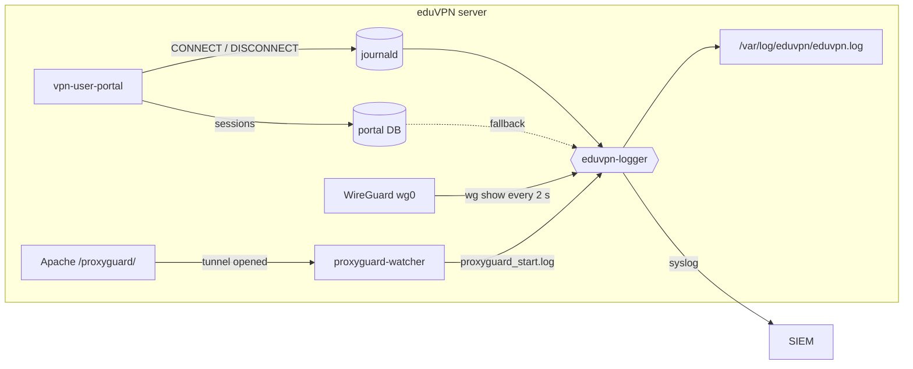
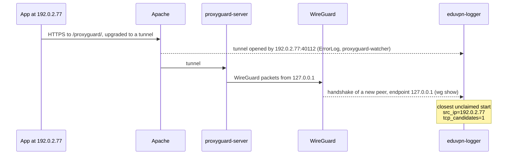

# eduvpn-logger

*🇮🇹 [Leggi in italiano](README.it.md)*

[](LICENSE)
[](#requirements)
[](https://www.eduvpn.org/)
[](#requirements)

**Who connected to your [eduVPN](https://www.eduvpn.org/) server, from where,
and when: one log line per WireGuard session event, in real time, ready for
your SIEM.**

eduVPN records the address a VPN client connects from only for OpenVPN: the
[eduVPN documentation](https://docs.eduvpn.org/server/v3/logging.html) states
that this *"is currently only available when clients connect using OpenVPN"*.
With WireGuard, no log answers the questions an incident response team sooner
or later has to answer: *which account was behind 203.0.113.45 last night?
Where did alice connect from? When did that session start and end?* The portal
knows the user but not the address. WireGuard knows the address but not the
user, has no notion of a connection and logs nothing. Behind ProxyGuard,
eduVPN's WireGuard-over-HTTPS fallback, even the kernel sees every client as
`127.0.0.1`.

**eduvpn-logger closes that gap.** It follows the portal, WireGuard and Apache
in real time, joins them on the WireGuard public key and writes one
`key=value` line per session event (`connect`, `roam`, `disconnect`) to a file
and to syslog:

```
2026-04-15T09:58:03.412871+02:00 event=connect user=alice profile=staff device=ios conn=soAQTNO...= tunnel_ip4="10.20.0.5" tunnel_ip6="fd00:20::5" src_ip="203.0.113.45" src_port=48049 transport=udp country="Italy" city="Trieste"
2026-04-15T10:41:22.090113+02:00 event=roam user=alice profile=staff device=ios conn=soAQTNO...= tunnel_ip4="10.20.0.5" tunnel_ip6="fd00:20::5" src_ip_old="203.0.113.45" src_port_old=48049 src_ip="198.51.100.12" src_port=51234 transport=udp country="Italy" city="Trieste"
2026-04-15T11:02:57.731204+02:00 event=disconnect user=alice profile=staff device=ios conn=soAQTNO...= bytes_in=227252 bytes_out=49292 src_ip="198.51.100.12" src_port=51234 transport=udp country="Italy" city="Trieste"
2026-04-15T12:10:04.861203+02:00 event=connect user=bob profile=students device=windows conn=GUUepz8z...= tunnel_ip4="10.20.1.9" tunnel_ip6="fd00:21::9" src_ip="192.0.2.77" src_port=40112 transport=tcp tcp_candidates=1 country="Austria" city="Vienna"
2026-04-15T13:27:41.528310+02:00 event=disconnect user=bob profile=students device=windows conn=GUUepz8z...= bytes_in=18733211 bytes_out=402115980 src_ip="192.0.2.77" src_port=40112 transport=tcp inferred=1 country="Austria" city="Vienna"
```

*alice connects from home, moves to the mobile network and disconnects; bob
reaches the server over ProxyGuard, then bob's laptop goes to sleep (public
keys shortened).*

- **Complete**: user, profile, device, tunnel addresses, public source IP and
  port (IPv4 and IPv6), transport, traffic, country and city.
- **Sees through ProxyGuard**: recovers the real address of clients that
  tunnel WireGuard over HTTPS, and says how certain each match is.
- **Self-contained**: a single-file Python daemon, standard library only, plus
  a small helper service for ProxyGuard. Nothing to compile, no patch to
  eduVPN, no kernel module.
- **Ready in one command** on every OS eduVPN 3 supports: it turns on what it
  needs in eduVPN, verifies every change and checks the result.
- **In production** at the University of Trieste.

## Contents

- [The problem](#the-problem)
- [What makes it different](#what-makes-it-different)
- [How it works](#how-it-works)
- [Requirements](#requirements)
- [Installation](#installation)
- [Configuration](#configuration)
- [Log format](#log-format)
- [Using the log](#using-the-log)
- [Limitations](#limitations)
- [Security and privacy](#security-and-privacy)
- [Upgrade and removal](#upgrade-and-removal)
- [FAQ](#faq)
- [Related projects](#related-projects)
- [License](#license)

## The problem

On an eduVPN server every fact about a WireGuard session lives in a different
place, and none of them is enough on its own:

| Source | Knows | Does not know |
|---|---|---|
| Portal (`vpn-user-portal`) | user, profile, public key, tunnel addresses and traffic of each session | where the client connects from: logged only for OpenVPN |
| WireGuard | public key, current endpoint, last handshake and traffic of each peer | users, connections, history: it logs nothing, and a new endpoint silently replaces the old one |
| Apache, with ProxyGuard | the real address of each TCP tunnel | which WireGuard peer the tunnel carries; its access log writes a request only when it ends, days later for a long tunnel |

The WireGuard public key is the only identifier the portal and WireGuard
share, and nothing at all links an Apache tunnel to a WireGuard peer. Generic
WireGuard loggers, such as [wglogger](https://codeberg.org/flaruina/wglogger),
record public keys and endpoints but leave the join with the portal to you,
and cannot see past ProxyGuard, whose traffic reaches WireGuard from
`127.0.0.1`. eduvpn-logger rebuilds the missing links, in real time.

## What makes it different

- **Sessions on a connectionless protocol.** WireGuard only keeps the current
  endpoint and the time of the last handshake of each peer. eduvpn-logger reads
  them every 2 seconds and derives connect, roam and disconnect events from
  them: no kernel module, no conntrack or eBPF, no patch to eduVPN.
- **The real address behind ProxyGuard.** Apache knows the client of a TCP
  tunnel, WireGuard knows the peer, and nothing ties the two. eduvpn-logger has
  Apache log each tunnel as it opens and matches it to the WireGuard handshake
  in time. Each tunnel is attributed once, and the `tcp_candidates` field says
  how many tunnels were possible, so an ambiguous match is visible as such.
- **Identity from the source of truth.** User and profile come from the
  portal's own CONNECT events; the portal database, read-only and with its
  schema detected at runtime, fills in when an event is missing.
- **No portal event lost.** The journal position is saved after every portal
  event: events logged while the daemon was stopped are processed when it
  starts, with their original timestamps.
- **Built around eduVPN's real behaviour.** Peers re-created by
  `vpn-maint-apply-changes` (zeroed counters, no handshake) neither end their
  sessions nor lose their traffic totals. A public key reused through the API
  starts a fresh session. A NAT changing only the port is not a roam. A
  flapping mobile connection gives at most one roam line every 30 s, and the
  last move is never lost. A session closed by the portal while `wg show` is
  running is not brought back.
- **SIEM-friendly.** One line per event, keys in a fixed order, the event time
  carried into the syslog copy, and user-supplied values sanitised so that they
  cannot forge keys.
- **Secure by default.** Portal events are accepted only from system accounts,
  by the sender's UID that journald records and the sender cannot forge. The
  service runs in a systemd sandbox with four capabilities and no network
  access. Logs are private (`0640 root:adm`) and kept 180 days.
- **Ready to use.** `install.sh` installs it with one command, turns on the
  portal's connection log and Apache's ProxyGuard trace when they are off (each
  change verified before it is applied, with a backup), and checks the result.
  Tested on Debian, Ubuntu, AlmaLinux and Fedora, and against real eduVPN 3
  servers.

## How it works



The daemon reads these sources and joins them on the **WireGuard public key**:

| Source | What it provides | How it is read |
|---|---|---|
| portal events | user, profile, public key, tunnel IPs, traffic | journald, `SYSLOG_IDENTIFIER=vpn-user-portal`, from the saved position |
| portal database | user, profile, tunnel IPs and app of a public key | `/var/lib/vpn-user-portal/db.sqlite`, table `wg_peers`, read-only, when an event is missing |
| WireGuard | endpoint (public `IP:port`), last handshake, traffic of each peer | `wg show all dump`, every 2 s |
| ProxyGuard *(optional)* | real client `IP:port` of each TCP tunnel, when it opens | Apache `ErrorLog` → `proxyguard-watcher` → `proxyguard_start.log` |

### From WireGuard state to sessions

WireGuard has no notion of a connection, so events are derived from the peer
state read at every poll:

- **connect**: a peer starts handshaking. If the portal has announced the
  session, the line is written at once, with the time of the portal event and
  the source of the handshake. Otherwise it waits up to 10 s for the portal
  event or the portal database to name the user, and carries the time of the
  first handshake. A session the portal announced that does not handshake
  within 2 minutes is written without a source, which follows in a roam line
  when the handshake comes.
- **roam**: the source of an active peer changes, including a switch between
  UDP and ProxyGuard. A change of the port alone (NAT rebinding) is ignored. At
  most one roam line per peer every 30 s: a move within that interval is
  written when the interval ends, stamped with the time it happened, unless the
  peer is back where it was.
- **disconnect**: when the eduVPN app disconnects, the portal's DISCONNECT is
  used, with its traffic counters. Otherwise (a generic WireGuard client, a
  laptop going to sleep, a lost network) the session ends after 180 s without a
  handshake, WireGuard's key lifetime, with WireGuard's own counters.

User, profile and tunnel addresses come from the portal's CONNECT event, or
else from the portal database by public key; `-` if neither knows the key.
`device` comes from the OAuth client ID of the eduVPN, Let's Connect! and
govVPN apps, as recorded by the portal. Connect and disconnect lines not
backed by a portal event carry **`inferred=1`** (roam lines always come from
WireGuard).

### ProxyGuard: recovering the real client address

On networks that block UDP the eduVPN apps reach WireGuard through
[ProxyGuard](https://docs.eduvpn.org/server/v3/wireguard.html): an HTTPS
connection to Apache, upgraded to a tunnel and handed to `proxyguard-server`,
which delivers the WireGuard packets to the local UDP port. WireGuard therefore
sees every such client as `127.0.0.1`.



With the trace that `install.sh` enables, Apache writes one line when a tunnel
opens (`AH10212 ... tunnel running`, with `[client IP:port]`), and
`proxyguard-watcher` turns it into a tunnel-start event. A new WireGuard
session, or a new tunnel of an active one, is matched to the closest start not
yet claimed, from about 30 s before to 3 s after WireGuard sees it; the start
is then claimed, so it cannot be given to another client. If the start has not
arrived yet, the connect waits up to 20 s for it. `tcp_candidates` reports how
many starts were in the window: `1` means there was no other candidate.

### Timing

| What | Default | Setting |
|---|---|---|
| WireGuard poll interval | 2 s | `EDUVPN_WG_POLL_SEC` |
| wait for the user of a new peer | 10 s | `EDUVPN_CONNECT_GRACE_SEC` |
| wait for the ProxyGuard start of a TCP session | 20 s | — |
| wait for the first handshake of a session announced by the portal | 120 s | — |
| ProxyGuard match window | 30 s + one poll before, 3 s after WireGuard sees the tunnel | — |
| minimum interval between roam lines of a peer | 30 s | `EDUVPN_ROAM_MIN_INTERVAL_SEC` |
| handshake silence before an inferred disconnect | 180 s (minimum) | `EDUVPN_DISCONNECT_AFTER_SEC` |

### State

The journal position is kept in `/var/lib/eduvpn-logger`. Everything else is
in memory and bounded by the live sessions: it is reconciled with `wg show` at
every poll. After a restart, sessions still active are announced again (see
[Limitations](#limitations)); a corrupted or expired journal position is
detected, reported, and reading restarts from the present.

## Requirements

- eduVPN v3 server (`vpn-user-portal`) with WireGuard, on any OS eduVPN 3
  supports: Debian, Ubuntu, Enterprise Linux (RHEL, AlmaLinux, Rocky) and
  Fedora. Tested on Debian 13, Ubuntu 22.04, 24.04 and 26.04, AlmaLinux 9 and
  10, Fedora 43 and 44.
- Portal and WireGuard on the same host: the daemon reads the portal's journal
  and database and runs `wg show` locally. Multi-node setups, with the portal
  on a separate controller, are not supported.
- systemd; `wireguard-tools` (`wg`) and Python ≥ 3.9, standard library only
  (both installed by `install.sh` if missing).
- The connect/disconnect templates (recommended) need vpn-user-portal ≥ 3.5.0;
  the portal's default log format is also understood.
- *Optional:* `python3-maxminddb` and a MaxMind GeoLite2-City database for
  `country` and `city` ([GeoIP](#geoip-optional)).

## Installation

On the eduVPN server:

```bash
git clone https://github.com/giacomocamata/eduvpn-logger.git
cd eduvpn-logger
sudo ./install.sh
```

On a standard eduVPN server nothing else is needed: `install.sh` installs the
logger, turns on what it needs on the eduVPN side if it is off, starts
everything and checks it. It is idempotent: re-run it to upgrade, or after
changing the eduVPN setup.

| Part | What `install.sh` does |
|---|---|
| portal connection log | if it is off, turns it on in `/etc/vpn-user-portal/config.php` with the recommended templates. The edit is checked with PHP before the file is replaced, the original is kept as `config.php.eduvpn-logger.bak`, and templates already set are kept. |
| ProxyGuard source IPs | if a VirtualHost proxies `/proxyguard/`: has Apache log tunnel starts, with a conf file of its own (`eduvpn-logger-proxyguard.conf`, then `configtest` and a graceful reload; removed again if `configtest` fails), and starts `proxyguard-watcher` on that VirtualHost's `ErrorLog` |
| packages | `wireguard-tools`, `python3`, `logrotate`; optional `python3-maxminddb`, `geoipupdate`. Only missing ones: nothing already installed is upgraded. |
| programs, units | `/usr/local/sbin/eduvpn-logger.py`, `proxyguard-watcher.py`; `/etc/systemd/system/eduvpn-logger.service`, `proxyguard-watcher.service` |
| logs | `/var/log/eduvpn` (`2750 root:adm`), rotated daily by `/etc/logrotate.d/eduvpn-logger`. If rsyslog is installed and runs as root (Debian, EL, Fedora; not Ubuntu), the syslog copy is also written there, to `eduvpn-syslog.log`. |
| state | `/var/lib/eduvpn-logger` (journal position) |

It ends with a check:

```
==> Check
  eduvpn-logger  active
  portal log     on
  portal DB      ok (128 WireGuard configurations)
  WireGuard      wg0
  ProxyGuard     watcher active, following /var/log/apache2/vpn.example.org_ssl_error.log
  GeoIP          off (optional: GEOIP_ACCOUNT_ID=... GEOIP_LICENSE_KEY=... ./install.sh)

==> Ready. Output: /var/log/eduvpn/eduvpn.log (also journalctl -t eduvpn-logger)
```

If something could not be done, `Ready` is replaced by the list of what is
left, which points to [Manual setup](#manual-setup). `portal log` reads
`on (portal's default format: no byte counters)` when the connection log was
already on without templates: it is understood and left as it is (a SIEM may
already parse it), but disconnects carry no traffic counters until the
templates are added.

### GeoIP (optional)

For `country` and `city`, create a free
[MaxMind account](https://www.maxmind.com/en/geolite2/signup) and a license
key, then run `install.sh` with them:

```bash
sudo GEOIP_ACCOUNT_ID=123456 GEOIP_LICENSE_KEY=xxxxxxxx ./install.sh
```

It writes `/etc/GeoIP.conf` (readable by root only; an account already there
is kept), downloads GeoLite2-City and makes sure it is updated weekly, as
MaxMind's license requires: Debian and Ubuntu's `geoipupdate` has its own
timer, elsewhere `eduvpn-logger-geoipupdate.timer` is added. The daemon
reopens the database when it changes. `geoipupdate` is packaged in Debian
(*contrib*), Ubuntu and Fedora; on Enterprise Linux install
[MaxMind's package](https://github.com/maxmind/geoipupdate/releases) first
(`python3-maxminddb` comes from EPEL, which eduVPN's installer enables).
Location is looked up only for public addresses.

### Verify

Connect a client with the eduVPN app and watch the output:

```bash
sudo tail -f /var/log/eduvpn/eduvpn.log
```

A `connect` line with the user and the public source IP should appear within a
few seconds of the tunnel coming up. Warnings from the daemon are in
`journalctl -u eduvpn-logger.service`.

| Symptom | Likely cause |
|---|---|
| no lines at all | the service is not running (`systemctl status eduvpn-logger`), or the portal's connection log is off: re-run `install.sh` and read its check |
| `user=-` on connect lines | portal DB not found or not readable: check `EDUVPN_PORTAL_DB`; or peers of a non-eduVPN WireGuard interface: set `EDUVPN_WG_INTERFACES` |
| `transport=tcp src_ip="-"` | Apache not tracing `/proxyguard/`, or the watcher reading the wrong `ErrorLog`: re-run `install.sh` (also after changing the VirtualHost), then see `systemctl cat proxyguard-watcher` and the `tail` of `proxyguard_start.log` |
| warning `ignoring unparsable/non-WireGuard event` | custom log template without `CONN=`, or an OpenVPN event (ignored by design) |
| warning `untrusted _UID=…` | a portal event logged by a non-system account was rejected (see [Limitations](#limitations)) |

### Manual setup

Only needed where `install.sh` says so, or without it.

<details>
<summary>Portal connection log</summary>

In `/etc/vpn-user-portal/config.php`, inside the `Log` section:

```php
'Log' => [
    'syslogConnectionEvents' => true,
    // recommended (vpn-user-portal >= 3.5.0): parsed reliably and carries byte counters
    'connectLogTemplate'    => 'CONNECT USER={{USER_ID}} PROFILE={{PROFILE_ID}} PROTO={{VPN_PROTO}} CONN={{CONNECTION_ID}} IP4={{IP_FOUR}} IP6={{IP_SIX}}',
    'disconnectLogTemplate' => 'DISCONNECT USER={{USER_ID}} PROFILE={{PROFILE_ID}} PROTO={{VPN_PROTO}} CONN={{CONNECTION_ID}} BYTES_IN={{BYTES_IN}} BYTES_OUT={{BYTES_OUT}}',
],
```

The setting is read on the next portal request; `vpn-maint-apply-changes` is not
needed. Without the two templates the portal's default format is used and also
understood, but disconnects then carry no byte counters. Custom templates must
start with `CONNECT` / `DISCONNECT` and keep the `USER=`, `PROFILE=` and `CONN=`
keys. Reference:
[eduVPN logging](https://docs.eduvpn.org/server/v3/logging.html).
Check that events arrive (connect a client first):
`journalctl -t vpn-user-portal -n 5`.

</details>

<details>
<summary>ProxyGuard source IPs</summary>

Add to the eduVPN VirtualHost (full snippet:
[`examples/apache-proxyguard.conf`](examples/apache-proxyguard.conf)):

```apache
<LocationMatch "^/proxyguard/">
    LogLevel warn proxy:trace1
</LocationMatch>
```

Apache then writes one `AH10212 ... tunnel running` line with `[client IP:port]`
to the VirtualHost `ErrorLog` when a tunnel opens; `proxyguard-watcher` turns it
into `proxyguard_start.log` next to Apache's logs (`/var/log/apache2`, or
`/var/log/httpd` on EL/Fedora), which the daemon reads. The `CustomLog` part of
the snippet is optional and not used by the daemon.

```bash
sudo apache2ctl configtest && sudo systemctl reload apache2    # EL/Fedora: apachectl, httpd
sudo systemctl enable --now proxyguard-watcher.service
```

`install.sh` points the watcher at the `ErrorLog` of the VirtualHost that
proxies `/proxyguard/`, e.g. `/var/log/apache2/vpn.example.org_ssl_error.log`
(`/var/log/httpd/vpn.example.org_ssl_error_log` on EL/Fedora). To follow
another file, override the command:

```bash
sudo systemctl edit proxyguard-watcher.service
```

```ini
[Service]
ExecStart=
ExecStart=/bin/sh -c 'exec tail -n 0 -F /path/to/error.log | python3 -u /usr/local/sbin/proxyguard-watcher.py'
```

</details>

<details>
<summary>Installation without <code>install.sh</code></summary>

```bash
sudo apt install -y wireguard-tools python3 logrotate    # dnf on Fedora/EL
sudo install -m 0755 eduvpn-logger.py proxyguard-watcher.py /usr/local/sbin/
sudo install -m 0644 systemd/eduvpn-logger.service systemd/proxyguard-watcher.service /etc/systemd/system/
sudo install -m 0644 examples/logrotate-eduvpn /etc/logrotate.d/eduvpn-logger
sudo install -m 0644 examples/rsyslog-10-eduvpn.conf /etc/rsyslog.d/10-eduvpn.conf   # only with rsyslog running as root
sudo install -d -m 2750 -o root -g adm /var/log/eduvpn
sudo systemctl daemon-reload
sudo systemctl enable --now eduvpn-logger.service
```

Then the two sections above. For GeoIP, configure `geoipupdate` and schedule it
weekly (`systemd/eduvpn-logger-geoipupdate.timer`), then restart the service.

</details>

## Configuration

All settings are environment variables with defaults for a standard eduVPN
server. Change them with a systemd drop-in, which survives re-installs (the
unit file itself lists every variable for reference). A value that is not a
number is ignored with a warning in `journalctl -u eduvpn-logger`, and the
default is used:

```bash
sudo systemctl edit eduvpn-logger.service
```

```ini
[Service]
Environment=EDUVPN_GEOIP_LANG=it,en
```

```bash
sudo systemctl restart eduvpn-logger.service
```

| Variable | Default | Meaning |
|---|---|---|
| `EDUVPN_LOG` | `/var/log/eduvpn/eduvpn.log` | output file |
| `EDUVPN_PORTAL_DB` | `/var/lib/vpn-user-portal/db.sqlite` | portal database (read-only) |
| `EDUVPN_PROXYGUARD_START_LOG` | `/var/log/apache2/proxyguard_start.log` (`/var/log/httpd/…` on EL/Fedora) | file written by `proxyguard-watcher` |
| `EDUVPN_STATE_DIR` | `/var/lib/eduvpn-logger` | journal position |
| `EDUVPN_GEOIP_DB` | *(searched)* | path of `GeoLite2-City.mmdb`; by default looked for in `/usr/local/share/GeoIP`, `/usr/share/GeoIP` and `/var/lib/GeoIP` |
| `EDUVPN_GEOIP_LANG` | `en` | language(s) of place names, first match wins, e.g. `it,en` |
| `EDUVPN_SYSLOG_IDENT` | `eduvpn-logger` | syslog program name |
| `EDUVPN_SYSLOG_FACILITY` | `local0` | syslog facility |
| `EDUVPN_WG_POLL_SEC` | `2.0` | `wg show` polling interval, seconds (minimum 0.5) |
| `EDUVPN_CONNECT_GRACE_SEC` | `10.0` | max wait for user attribution before writing a connect |
| `EDUVPN_DISCONNECT_AFTER_SEC` | `180.0` | handshake silence before an inferred disconnect; values below 180 are raised to 180 |
| `EDUVPN_ROAM_MIN_INTERVAL_SEC` | `30.0` | minimum interval between roam lines per peer |
| `EDUVPN_WG_INTERFACES` | *(all)* | WireGuard interfaces to follow, comma-separated, e.g. `wg0`; set it if the server runs other WireGuard tunnels |

The syslog copy goes to the journal (`journalctl -t eduvpn-logger`) and, with
rsyslog running as root, to `/var/log/eduvpn/eduvpn-syslog.log`; forward it to
your SIEM from there. To try settings without touching the service, run a
second instance with its own output and state directory:

```bash
sudo EDUVPN_LOG=/tmp/test.log EDUVPN_STATE_DIR=/tmp/eduvpn-test EDUVPN_SYSLOG_IDENT=eduvpn-logger-test /usr/local/sbin/eduvpn-logger.py
```

## Log format

`<ISO-8601 timestamp, µs, UTC offset> key=value ...`. The timestamp is when the
event happened, not when the line was written, so lines are not strictly in
timestamp order: a connect held for its source, or a roam held back by the
30 s limit, can be written up to two minutes later. The lines of one session
are always written in order (connect, roam, disconnect). Keys come in a fixed
order; optional keys are left out when they do not apply, and unknown values
are `-`. Values that may contain `:` or spaces are double-quoted; `user` and
`profile` are sanitised (whitespace, quotes, `=` and control characters become
`_`), so they cannot inject extra keys. New keys may be added in future
versions: ignore unknown ones.

The syslog copy (facility `local0`, priority `info`) carries the same keys
without the leading timestamp, since syslog stamps the time the line was
written, and adds the event time as `ts="<ISO-8601>"` at the end: use that one
in the SIEM.

| Field | Events | Meaning |
|---|---|---|
| `event` | all | `connect`, `roam`, `disconnect` |
| `user`, `profile` | all | from the portal or its DB; `-` if unknown |
| `device` | when known | `android`, `ios`, `windows`, `macos`, `linux` (eduVPN, Let's Connect! or govVPN app) |
| `conn` | all | WireGuard public key: the session key across lines |
| `tunnel_ip4`, `tunnel_ip6` | connect, roam | addresses assigned inside the VPN |
| `bytes_in`, `bytes_out` | disconnect | traffic seen from the server (`in` = sent by the client): from the portal, or WireGuard counters for inferred disconnects; `-` with the portal's default log format |
| `src_ip_old`, `src_port_old` | roam | source address before the roam |
| `src_ip`, `src_port` | all | public source address, IPv4 or IPv6; `-` if unknown |
| `transport` | all | `udp`, `tcp` (ProxyGuard) or `unknown` |
| `tcp_candidates` | connect, roam over `tcp` | tunnel starts the source IP was chosen among; `1` = no other candidate (see [Limitations](#limitations)) |
| `inferred` | connect, disconnect | `1`: derived from WireGuard state, not reported by the portal |
| `country`, `city` | with GeoIP, public IPs | location of `src_ip` |

Most SIEMs extract `key=value` pairs natively (for example Splunk's automatic
key-value extraction, the Elasticsearch `kv` processor or the Logstash `kv`
filter). In Python:

```python
import re
KV = re.compile(r'(\w+)=("[^"]*"|\S+)')
fields = {k: v.strip('"') for k, v in KV.findall(line)}
```

## Using the log

Rotated files are dated and compressed (`eduvpn.log-20260415.gz`): `zgrep`
reads them together with the current one.

```bash
# Who was behind a public address (also as the old address of a roam)
zgrep -hE 'src_ip(_old)?="203\.0\.113\.45"' /var/log/eduvpn/eduvpn.log*

# Everything one user did
zgrep -h ' user=alice ' /var/log/eduvpn/eduvpn.log*

# Who had a tunnel address, e.g. one seen in a firewall log: the connect line
# names the user and the public key, then follow the key to its disconnect
zgrep -h 'tunnel_ip4="10.20.0.5"' /var/log/eduvpn/eduvpn.log*
zgrep -hF ' conn=<public key> ' /var/log/eduvpn/eduvpn.log*

# Connections from abroad (with GeoIP)
zgrep -h ' event=connect .*country=' /var/log/eduvpn/eduvpn.log* | grep -v 'country="Italy"'
```

## Limitations

- **ProxyGuard source IPs are matched by time.** Apache's tunnel start and the
  WireGuard handshake share no identifier, so the closest start of the previous
  30 s is used, once. Clients opening TCP tunnels within the same few seconds
  can be swapped, and `/proxyguard/` is reachable without authentication. Treat
  `tcp_candidates` above 1 as probable, not certain; `1` holds only if the
  watcher sees every tunnel start (if one is missing, the start left may be
  another client's). UDP source IPs come from the kernel and are exact.
- **Portal events are trusted by sender.** Any local user can write to the
  journal with `logger -t vpn-user-portal`; only entries whose `_UID` (set by
  journald) is a system account (≤ `SYS_UID_MAX`, normally 999: root,
  `www-data`, `apache`) are accepted.
- **Inferred disconnects** are written, and timestamped, when the 180 s
  silence threshold is crossed, i.e. up to 3 minutes after the last activity.
- **After a restart** the daemon does not know which sessions it had already
  logged: active peers get a new `connect` with `inferred=1`, timestamped with
  their last handshake (up to 3 minutes earlier) and the source seen after the
  restart; for ProxyGuard sessions `src_ip="-"` (the line written before the
  restart has the IP). Roams that happened while it was stopped are not seen.
- **Sampling.** WireGuard is read every `EDUVPN_WG_POLL_SEC`: a roam and back
  within one interval is not seen, and a session shorter than one interval has
  no source address (its connect and disconnect still come from the portal).

## Security and privacy

The log contains personal data (user IDs, public IPs, location): define purpose,
legal basis and retention with your Data Protection Officer.

- **Access**: logs are created `0640 root:adm` in a `2750` directory.
- **Retention**: `/etc/logrotate.d/eduvpn-logger` rotates daily and keeps 180
  days; change `rotate` to your policy. `proxyguard_start.log` follows the
  distribution's Apache rotation (14 days on Debian and Ubuntu).
- **Integrity**: anyone with root on the server can alter a local file; for
  evidential use, forward the syslog stream to a remote collector in real time
  (rsyslog `omfwd` over TLS, or RELP).
- **Privileges**: both services run as root inside a systemd sandbox (with
  SELinux, on EL/Fedora, as `unconfined_service_t`: no policy module needed).
  `eduvpn-logger` keeps only `CAP_NET_ADMIN` (`wg show`),
  `CAP_DAC_READ_SEARCH`/`CAP_DAC_OVERRIDE` (reading the portal DB) and
  `CAP_CHOWN` (a WAL-mode DB gets `-wal`/`-shm` files that must belong to the
  portal), and can open only local (`AF_UNIX`) and netlink sockets: no network
  connections. `proxyguard-watcher` has no capabilities and no network. Inspect
  with `systemd-analyze security eduvpn-logger.service`.
- **Read-only towards eduVPN**: the portal database is opened read-only, and
  the daemon never writes to eduVPN's files or to WireGuard.

## Upgrade and removal

Upgrade (drop-ins and logs are kept; running services are restarted, a
service you stopped or disabled is left alone; the eduVPN side is checked as on
a first install):

```bash
cd eduvpn-logger && git pull && sudo ./install.sh
```

Settings that an older version had you edit directly into the unit files
(`Environment=` lines, the watcher's `ErrorLog` path) are moved to
`<unit>.d/00-migrated.conf` before the units are replaced.

Removal (logs in `/var/log/eduvpn` are left in place):

```bash
sudo systemctl disable --now eduvpn-logger.service proxyguard-watcher.service
sudo systemctl disable --now eduvpn-logger-geoipupdate.timer     # if install.sh added it
sudo rm -f /usr/local/sbin/eduvpn-logger.py /usr/local/sbin/proxyguard-watcher.py \
    /etc/systemd/system/eduvpn-logger.service /etc/systemd/system/proxyguard-watcher.service \
    /etc/systemd/system/eduvpn-logger-geoipupdate.service /etc/systemd/system/eduvpn-logger-geoipupdate.timer \
    /etc/logrotate.d/eduvpn-logger /etc/rsyslog.d/10-eduvpn.conf
sudo rm -rf /etc/systemd/system/eduvpn-logger.service.d \
    /etc/systemd/system/proxyguard-watcher.service.d /var/lib/eduvpn-logger
sudo systemctl daemon-reload
```

Apache's trace of ProxyGuard tunnels:

```bash
sudo a2disconf eduvpn-logger-proxyguard && sudo rm /etc/apache2/conf-available/eduvpn-logger-proxyguard.conf \
    && sudo systemctl reload apache2                                                  # Debian/Ubuntu
sudo rm /etc/httpd/conf.d/eduvpn-logger-proxyguard.conf && sudo systemctl reload httpd  # EL/Fedora
```

(or the `LocationMatch` block, if you added it to the VirtualHost by hand). The
portal's connection log stays on; if `install.sh` turned it on, the previous
`config.php` is in `config.php.eduvpn-logger.bak`.

## FAQ

**Does it change eduVPN?** It only reads the portal's journal and database,
WireGuard's state and Apache's log. `install.sh` changes two settings, and only
if they are off: the portal's connection log and, with ProxyGuard, Apache's log
level for `/proxyguard/`. Both are verified before they are applied.

**What does it cost?** One `wg show all dump` every 2 s and a few read-only
SQLite queries per new session. Memory follows the number of active sessions.

**What about OpenVPN?** The portal already logs the client address of OpenVPN
sessions (`originatingIp`); eduvpn-logger ignores them.

**Can I trust the source IP?** Over UDP, yes: it comes from the kernel. Over
ProxyGuard it is a time match, with `tcp_candidates` telling how many tunnels
were possible.

**What happens while the logger is stopped?** Portal events are processed when
it starts again, with their original timestamps; roams in between are not
seen, and sessions still active are announced again with `inferred=1`.

**Several eduVPN nodes?** Not supported: the portal and WireGuard must run on
the same host.

## Related projects

- [eduvpn-fortigate-rsso](https://github.com/giacomocamata/eduvpn-fortigate-rsso)
  follows this log and sends every session's user and tunnel address to a
  FortiGate as RADIUS Accounting (RSSO), for identity-based firewall policies
  and per-user firewall logs.

## License

MIT, see [LICENSE](LICENSE).
